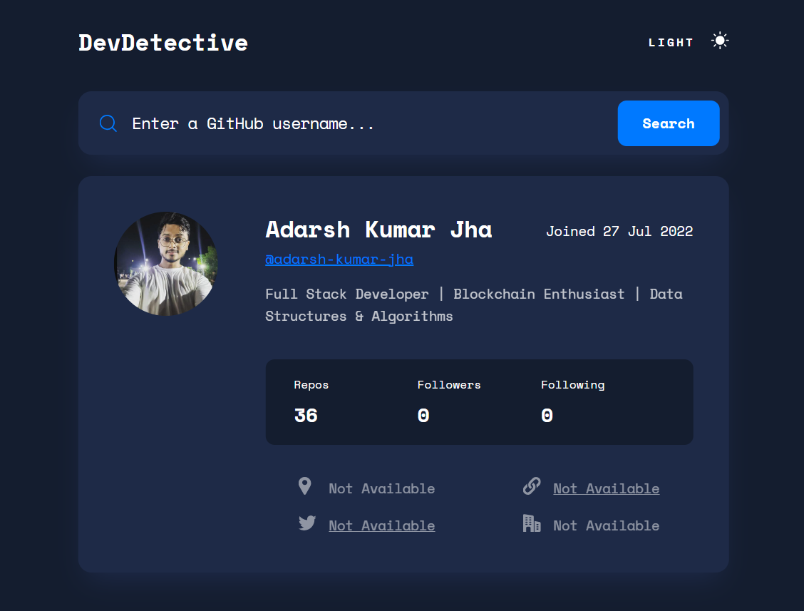

# DEV-DETECTIVE

It is a simple web application that allows users to search for GitHub profiles and view detailed information about the user. It features a responsive design for a seamless experience on different devices and includes both light and dark modes.

## Table of Contents
- [Features](#features)
- [Usage](#usage)
- [Installation](#installation)
- [Contributing](#contributing)
- [License](#license)


## Features

- Search for GitHub profiles using the username.
- View detailed information about the user, including profile picture, name, bio, and more.
- Responsive design for optimal viewing on various devices.
- Light and dark modes for a comfortable viewing experience.

## Usage

1. Enter the GitHub username in the search bar.
2. Click the "Submit" button or press "Enter" to fetch the user's data.
3. Explore the detailed information about the user.
4. Toggle between light and dark modes for a personalized experience.

## Installation

To run the project locally, follow these steps:

1. Clone the repository:

   ```bash
   git clone https://github.com/your-username/your-repo.git
   ```

2. Open the `index.html` file in your web browser.

3. Start exploring GitHub profiles!

## Contributing

If you'd like to contribute to this project, please follow these steps:

1. Fork the repository.
2. Create a new branch: `git checkout -b feature/new-feature`.
3. Make your changes and commit them: `git commit -m 'Add new feature'`.
4. Push to the branch: `git push origin feature/new-feature`.
5. Submit a pull request.

## License

This project is licensed under the MIT License - see the [LICENSE.md](LICENSE.md) file for details.

